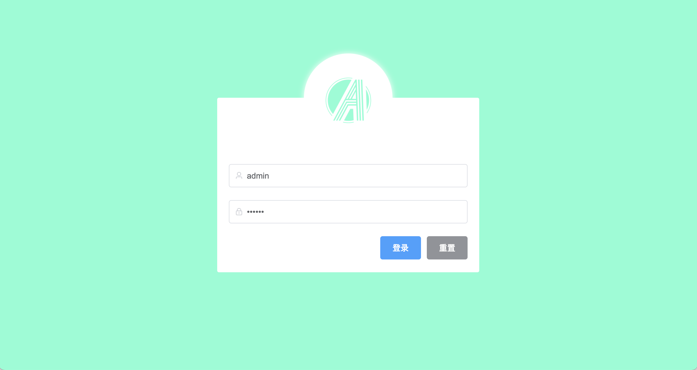
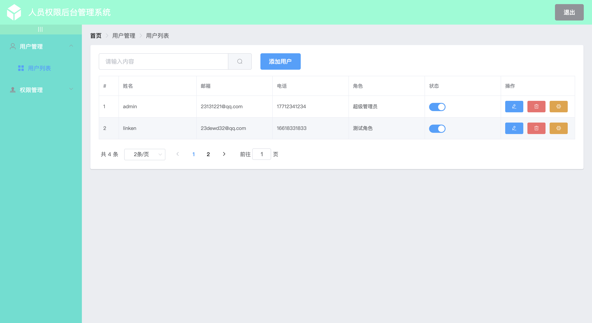
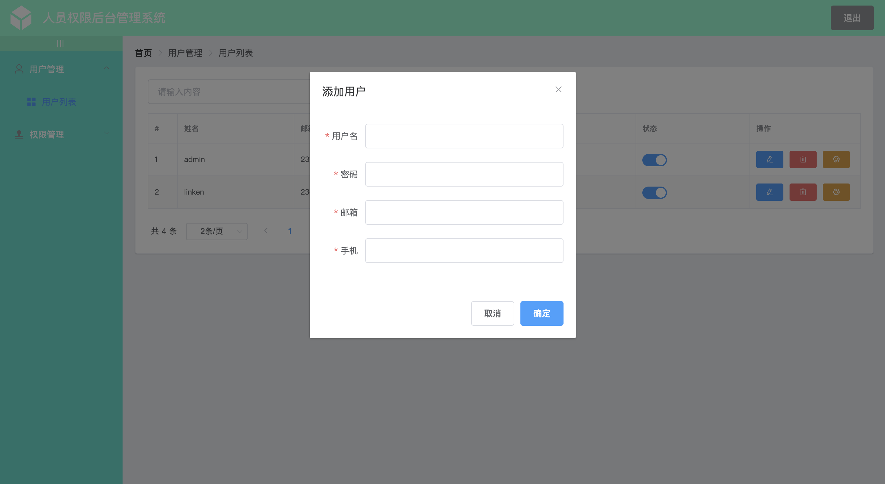
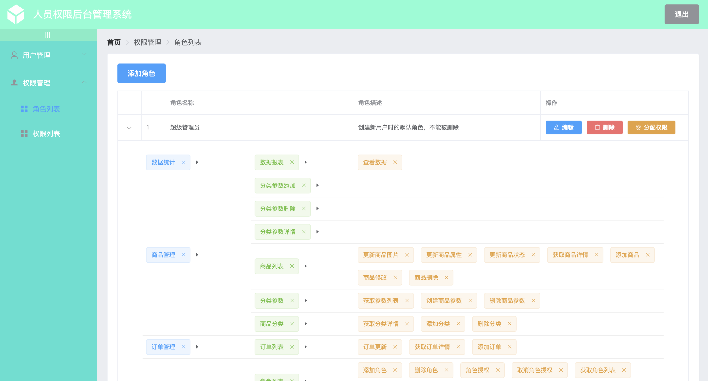
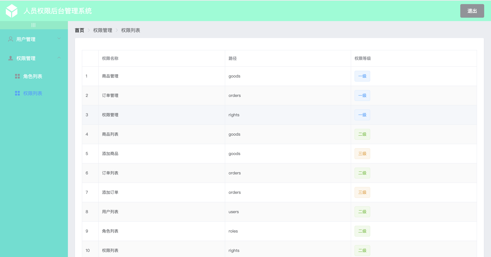

## 项目介绍


这是一个前后端分离的人员权限后台管理系统，项目采用 SpringBoot+Vue 开发。功能主要包括人员添加、编辑、删除，对于人员的角色分配，对于角色添加、编辑、删除，以及对于角色的权限分配。也就是说，管理权限的方式是人员--->角色--->权限。项目的前端静态资源使用nginx部署，后端springboot被打包成jar放到服务器上直接运行。


项目演示地址:   <http://arino.top:8080>


### 项目技术栈

#### 后端技术栈

| 技术           | 说明              |
| -------------- | ----------------- |
| SpringBoot     | Spring框架脚手架  |
| SrpingSecurity | 认证和授权框架    |
| MyBatis        | 持久层框架        |
| JWT            | 用于实现Token认证 |
| Lombok         | 简化对象封装工具  |
| Nginx          | 静态资源服务器    |

#### 前端技术栈

| 技术       | 说明         |
| ---------- | ------------ |
| Vue        | 前端框架     |
| Vue-router | 路由框架     |
| Element    | 前端UI框架   |
| Axios      | 前端HTTP框架 |


### 项目效果图












### 快速部署

1. clone 项目到本地 `git@github.com:arinoyu/management-system.git`
2. 在本地mysql新创建一个数据库，导入system.sql，同时在application.yml更改连接数据库的信息。
3. 用IDEA导入后端项目shop，运行启动类ShopApplication.java

**至此，后端项目已部署完毕，你可以尝试在地址栏输入`http://localhost:8888`，若返回一串json数据，则说明后端部署成功**

4. 进入到前端项目vue_shop目录中，在命令行依次输入如下命令：

```
# 安装依赖
npm install

# 在 localhost:8080 启动项目
npm run serve
```

**至此，整个项目前后端都已部署完毕**

